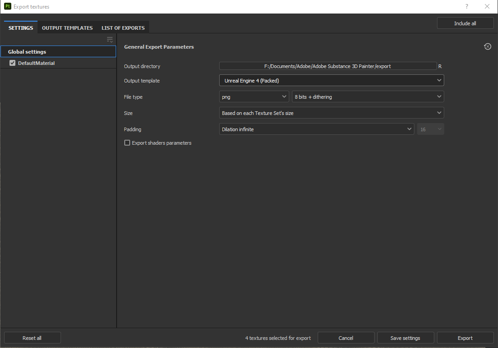
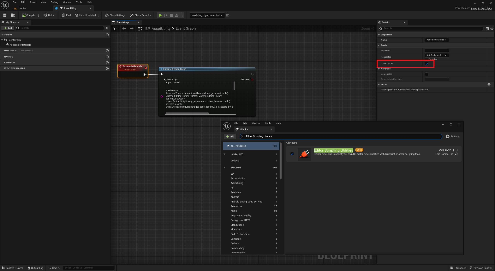
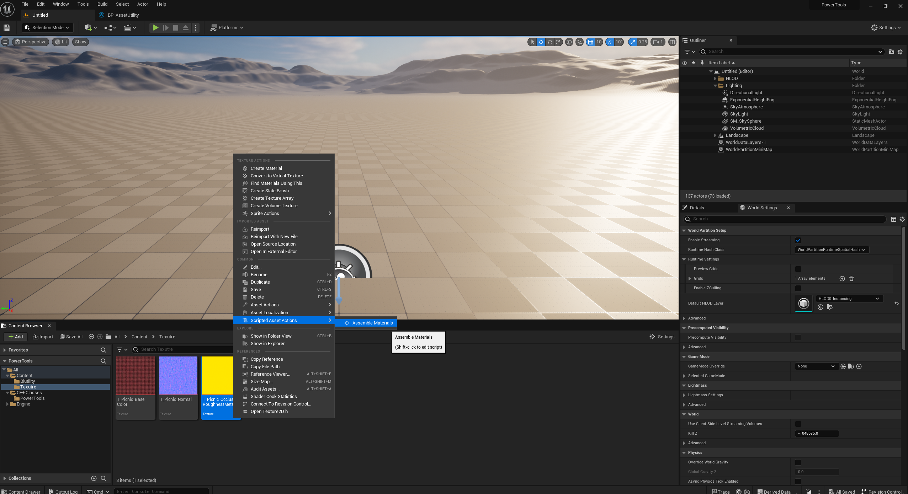
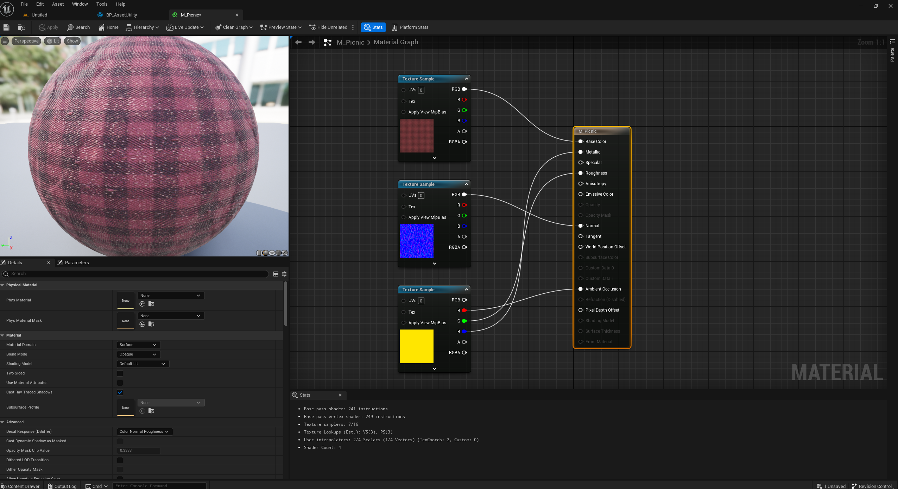

# MaterialAssembler

This is a small python script to assemble materials in **Unreal Engine 5** current Content Browser with a texture set like this: 
- **MaterialName_BaseColor**
- **MaterialName_OcclusionRoughnessMetallic**
- **Materialname_Normal**
 
This is for a specific case, where the script helps to accelerate assembling Materials.  
Feel free to use or modify it for your personal use!  
  
 

This is the output setup I use in Substance Painter.  
  
   
 

1. Make sure the **Editor scripting Utilities** plugin is enabled.
2. Create an **Editor Utilty** blueprint and pick **Asset Action Utility** as parent class.
3. Create a **Custom Event** node and make sure **Call in Editor** is enabled in the node's details.
4. Link an **Execute Python Script** node to the custom event and insert the MaterialAssembly.py script (Copy and Paste the script inside the file).
5. Compile and Save
  
   

1. Open the **Content Browser** and right-click on one of the texture.
2. Then select: **Scripted Asset Actions -> Name of your custom event**

  
   

Here's an example of a Material assembled with the script.

  
   
